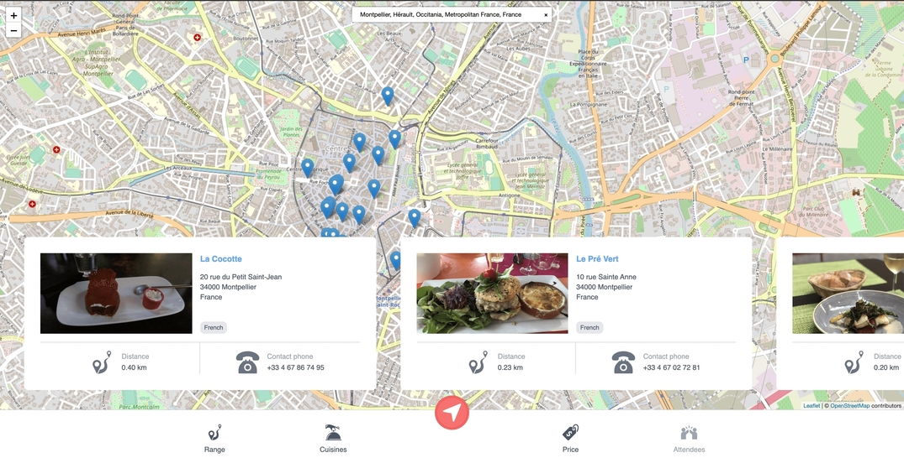

# Foodby

Very simple interface to find a desired restaurant in your neighbourhood.

## Table of contents

* [About](#about)
* [Project structure](#project-structure)
    + [Tech stack](#tech-stack)
    + [Services](#services)
* [Running it locally](#running-it-locally)
    + [Prerequisites](#prerequisites)
    + [Available commands](#available-commands)
    + [Running apps](#running-apps)
* [Further changes](#further-changes)
* [Contact](#contact)

## About

The main assumption is that to allow user just to open the application and easily find interesting restaurants nearby.
From the user perspective, there is a possibility to write down the current location in the search bar, and add optional
filters like range (the max distance between user location and the restaurant), cuisine types, price.

> below features are in progress

Additionally, user is able to sign in and out. In his/her settings is able to add preferred cuisines (which will fill
initially the cuisine filter on the map view) and create a friend list (each friend can have it own preferred cuisines).
Logged user has one more additional filter - to select friends who will attend with him/her to restaurant. Basing on all
the attendees, application will choose particular cuisine types to fulfil all attendees' desires.

## Project structure

Project is structured in a monorepo & microservices way, so under the packages directory there are multiple
microservices and microfrontends.

### Tech stack

1. Backend
    - NestJs
    - TypeScript
2. Frontend
    - React
    - TypeScript
    - React Query
    - Leaflet
    - Storybook

### Services

1. Backend
    - Search - (Nest.js) - it's providing a data from the external restaurants API
    - Server - (Nest.js) - aggregate application, it's providing a REST API for web clients
    - Authentication (in plans) - (Nest.js) - it's providing a possibility to sign in/out
2. Frontend
    - Common Components UI - (React) - all the common components used across all the applications
    - Web UI - (React) - aggregate application
    - Map UI (in plans) - (React) - application with map view (currently inside Web UI service)
    - Users UI (in plans) - (React) - application with user settings view
    - Mobile App (in plans) - (probably React Native)
3. Commons - common logic and models used across all the both backend and frontend services

## Running it locally

### Prerequisites

Application is using a [Yelp](https://www.yelp.com) as a service for receiving restaurant data, so it's necessary to
receive the [API Key](https://www.yelp.com/developers/documentation/v3/authentication) from there and put it into the
[Search Service](https://github.com/pgalias/foodby/tree/main/packages/search) .env file under the **YELP_API_KEY**

Moreover, application is using the yarn workspaces, so yarn is only one available package manager here.

### Available commands

- `yarn start:frontend` - runs all the microfrontends at once
- `yarn start:backend` - runs all the microservices at once
- `yarn start:storybook` - runs a storybook from the Common Components UI package
- `yarn test` - runs a tests scripts from all the packages
- `yarn lint` - runs a lint scripts from all the packages

### Running apps

1. Run all the backend services by `yarn start:backend`
2. Run all the frontend services by `yarn start:frontend` (in different terminal session)
3. Go to `localhost:3000`

## Further changes

All the plans for the application can be found [here](https://github.com/pgalias/foodby/projects)

## Contact

Pawel Galias - [linkedin](https://linkedin.com/in/pawgalias) - [pawel@galias.me](pawel@galias.me)

Project Link: [https://github.com/pgalias/foodby](https://github.com/pgalias/foodby)

Are you seeing bugs or potential improvements? Your feedback is more than welcome!
